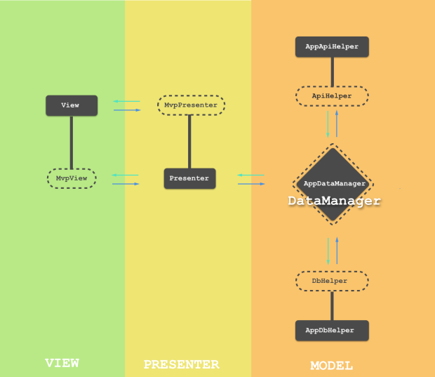

# Firestore-mvp-rxjava2-kotlin-localdb

## Введение

Это приложение задействует многие аспекты разработки Андроид приложений, включая архитектуру (MVP), серверную (Firebase) и локальную базу данных (Realm), реактивное программирование (RxJava2), язык программирования Котлин и др.

## Структура приложения

## Туториал по приложению доступен на сайте [firebase-info.com][firebaseinfo]

## Как начать
* Скачайте данный проект
* Откройте его с помощью Андроид Студио
* В [Консоли Firebase][firebase-console] создайте новое приложение ([как это сделать смотрим тут в разделе Подключение][sample-1])
* В Консоли Firebase в разделе Database включитe Firestore
* Подключите Firebase к вашему андроид проекту ([подробней тут][sample-2])
* Запустите приложение.

## Документация
Документация, новости и туториалы на русском языке доступны на сайте [firebase-info.com][firebaseinfo].

## Подпишись! :)
* Сайт: [firebase-info.com][firebaseinfo]
* Телеграм-канал: https://t.me/firebaseinfo
* Телеграм-чат: https://t.me/firebaseinfo
* VK: https://vk.com/firebaseinfo
* Youtube: https://www.youtube.com/channel/UCkWmMVE_80TdTGj6fDuKORA
* Facebook: https://www.facebook.com/firebaseinfo/

[firebase-console]: console.firebase.google.com
[sample-1]: https://firebase-info.com/2017/06/10/%D0%BE%D1%81%D0%BD%D0%BE%D0%B2%D1%8B-firebase-3-3-firebase-%D0%B0%D1%83%D1%82%D0%B5%D0%BD%D1%82%D0%B8%D1%84%D0%B8%D0%BA%D0%B0%D1%86%D0%B8%D1%8F-%D0%BF%D0%BE%D0%B4%D0%BA%D0%BB%D1%8E%D1%87%D0%B5/
[sample-2]: https://www.youtube.com/watch?v=bOmkJdEtpjo
[firebase-libraries1]: https://firebase.google.com/support/release-notes/android
[firebase-libraries2]: https://firebase.google.com/docs/android/setup
[firebaseinfo]: https://firebase-info.com/%D0%BA%D0%B0%D1%80%D1%82%D0%B0-%D1%81%D0%B0%D0%B9%D1%82%D0%B0/